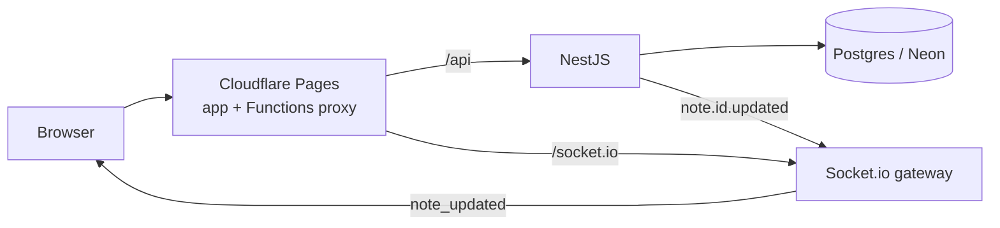

# mini-notion

A small Notion-style note app with live sync between open windows.

**Live:** https://mini-notion.pages.dev

- Email and password accounts. The session is a JWT in an HttpOnly cookie.
- Notes with a block editor: paragraph, checklist, image, code.
- Auto-save, one second after you stop typing.
- Live sync over Socket.io between every open window of the same note, with remote cursors and short labels like "checked" or "added image block".
- Conflict check: a save based on an old version gets `409`, never a silent overwrite.

## Stack

| Part | Tech |
|---|---|
| Backend | NestJS 11, Prisma 7 (`pg` adapter), Socket.io, Passport JWT, nestjs-zod |
| Frontend | React 19 (React Compiler), Vite, TanStack Router, BlockNote, shadcn/ui, zustand |
| Shared | zod schemas for every request body, used by both sides |
| Database | Postgres on Neon |
| Hosting | Frontend on Cloudflare Pages; Pages Functions proxy `/api` and `/socket.io` to the backend, so the cookie stays first-party |



## Run it locally

Needs Node 24 and pnpm 10.

```bash
pnpm install
echo 'DATABASE_URL=postgres://...' > backend/.env    # any Postgres
(cd backend && npx prisma migrate deploy && npx prisma generate)
pnpm --filter backend start:dev     # http://localhost:3000/api
pnpm --filter frontend dev          # http://localhost:5173
```

## How this repo is built

Most of the code here is written together with an AI coding agent (Claude Code). An agent starts every session with no memory, and it will happily say "done" without checking. So the repo carries its own memory and its own rules, and the agent has to go through them on every task.

| Piece | Where | What it does |
|---|---|---|
| **Living wiki** | [`wiki/`](wiki/index.md) | The project's memory. Every page lists the source files it describes and the commit it was checked against, plus a `confidence` level that drops as those files change. Wrong claims are corrected with a dated "superseded" note, not silently rewritten. |
| **ADRs** | [`wiki/architecture/decisions.md`](wiki/architecture/decisions.md) | Why things are the way they are: cookie auth, block storage, conflict check, hosting. New work starts as a `Proposed` ADR with requirements and success criteria. |
| **Written rules** | [`.agents/core/`](.agents/core/README.md), [`.agents/project/`](.agents/project/README.md) | `core` is portable and is copied as-is between my projects (this one was ported from Laravel/PHP projects). `project` holds the parts that only fit this stack. |
| **Pre-turn gate** | [`CLAUDE.md`](CLAUDE.md) | Before touching code: read the wiki index, the relevant pages, the ADRs and the recent log. |
| **Post-turn gate** | [`CLAUDE.md`](CLAUDE.md) | Before saying "done": pass the test gate, write decisions, gotchas and new terms back to the wiki, and log the change. |
| **Test gate** | `pnpm review` | Type checks for both apps, then backend unit and e2e tests. A fix counts only after it is shown to make the right test fail when removed. Rules: [`testing.md`](.agents/project/testing.md). |
| **Production safety** | [`production-safety.md`](.agents/project/production-safety.md) | What the agent must never run against the live database. |
| **Log** | [`wiki/log.md`](wiki/log.md) | Append-only history of what each session changed and why. |

Good starting points: [wiki overview](wiki/overview.md), [decisions](wiki/architecture/decisions.md), [realtime](wiki/modules/realtime.md).
