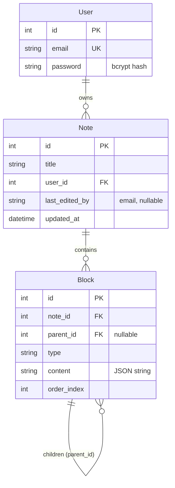

# Data model

Postgres, managed by Prisma 7. One migration: `20260926184755_init` (recreated when the app moved from SQLite to Postgres, see [ADR-008](decisions.md#adr-008-postgres-on-neon)).

All three tables also have `created_at` and `updated_at` (`@updatedAt`).

## How a note's content is stored

The editor works with a tree of BlockNote blocks. The backend flattens it into `Block` rows (`NoteService.saveBlocks`) and builds it back (`NoteService.reconstructBlocks`).

| Field | Holds |
|---|---|
| `type` | BlockNote type, renamed: `checkListItem` → `checklist`, `codeBlock` → `code`. Others (`paragraph`, `image`) are stored as is. |
| `content` | `JSON.stringify({ id, props, content })` of the BlockNote block. `id` is the editor's own block id, not the row id. |
| `parent_id` | Row id of the parent block, for nested blocks. `null` at the top level. |
| `order_index` | Position among siblings, from 0. |

Every save **deletes all blocks of the note and inserts them again**, inside one transaction (`NoteService.updateNote`). Row ids are not stable between saves. See [ADR-003](decisions.md#adr-003-store-blocks-as-rows-rewrite-on-every-save).

If `content` is not valid JSON, `reconstructBlocks` falls back to `{ id: <row id>, props: {}, content: <raw string> }`.

## Ownership

`Note.user_id` is the owner. Only `getNotes` (list) and `deleteNote` filter by `user_id`; for those, another user's note looks like "not found" (404). `getNoteById` and `updateNote` look up by `id` only, so any logged-in user can open and save a note by its URL ([ADR-015](decisions.md#adr-015-any-logged-in-user-can-open-and-edit-a-note-by-its-url)).

> **Superseded 2026-10-01**: previously said every service method filters by `user_id` and there is no sharing between users.
