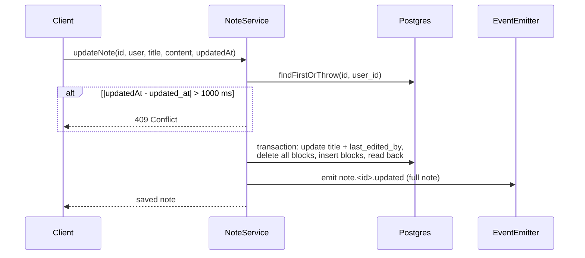

# Notes API

REST CRUD for notes. Storage format is in [data model](../architecture/data-model.md). Live push after a save is in [realtime](realtime.md).

## Endpoints

All use `JwtAuthGuard` and only see the caller's own notes ([ADR-006](../architecture/decisions.md#adr-006-a-note-is-only-visible-to-its-owner-also-over-the-socket)).

| Method | Path | Body | Result |
|---|---|---|---|
| POST | `/api/notes` | `{ title }` | The new note, `content: []`. |
| GET | `/api/notes` | — | All the user's notes, each with `content` rebuilt from blocks. |
| GET | `/api/notes/:id` | — | One note with `content`. 404 if missing or not owned. |
| PUT | `/api/notes/:id` | `{ title, content?, updatedAt? }` | The saved note with `content`. 404, or 409 on conflict. |
| DELETE | `/api/notes/:id` | — | Deletes blocks, then the note. 404 if missing or not owned. |

`title` (`TitleSchema`): trimmed, 1–100 characters, no line breaks. `content` is `z.any()` — not validated.

## Save flow (`PUT`)

- `last_edited_by` is set to the caller's email on every save. The frontend uses it to label remote changes.
- If `content` is left out, blocks are not touched; only the title is saved.

## Errors

`handlePrismaNotFound` turns Prisma `P2025` (record not found, thrown by `findFirstOrThrow`) into a `NotFoundException`. Other errors pass through.
