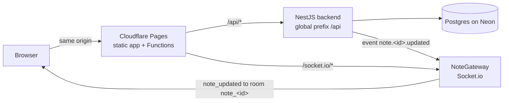

# Overview

mini-notion is a small Notion-style note app with live sync between open windows. See [SCHEMA](SCHEMA.md#what-this-repo-is-about) for the one-paragraph summary.

## Layout

| Path | What it is |
|---|---|
| `backend/` | NestJS 11 API and Socket.io gateway. Prisma 7 with the `pg` driver adapter. |
| `frontend/` | React 19, Vite, TanStack Router, BlockNote editor, shadcn/ui, zustand. |
| `frontend/functions/` | Cloudflare Pages Functions that proxy `/api` and `/socket.io` to the backend. |
| `shared/` | zod schemas (`*.schema.ts`) and Nest DTO classes (`*.dto.ts`) for request bodies. |
| `scripts/deploy.sh` | Deploys the backend to the OCI VM or the frontend to Cloudflare Pages. |
| `Dockerfile` | Backend image, added for Koyeb (commit `d34cea3`). Unused: the backend runs on the OCI VM without Docker ([ADR-016](architecture/decisions.md#adr-016-backend-on-the-owners-oci-vm-not-hashbang), [ADR-014](architecture/decisions.md#adr-014-backend-on-own-hashbang-account-not-koyeb)). |

Path aliases: `backend/*`, `frontend/*` and `shared/*` resolve from the repo root (`tsconfig.base.json`, Vite `resolve.alias`, Jest `moduleNameMapper`).

## How the parts talk

In local dev there is no proxy: the frontend calls `VITE_API_URL` or `http://localhost:3000` directly (`frontend/src/lib/utils.ts`).

## Backend wiring (`app.module.ts`)

- Global `ZodValidationPipe` and `ZodSerializerInterceptor` (nestjs-zod) validate request bodies against the shared schemas.
- `HttpExceptionFilter` logs zod serialization errors, then uses Nest's default handling.
- `EventEmitterModule.forRoot({ wildcard: true })` — wildcard is required, see [pitfalls](architecture/pitfalls.md).
- `ConfigModule` is global and loads `backend/.env`.

## Modules

- [auth](modules/auth.md) — register, login, logout, JWT cookie.
- [notes](modules/notes.md) — note CRUD, block storage, conflict check.
- [realtime](modules/realtime.md) — Socket.io rooms, live updates, remote cursors.
- [frontend](modules/frontend.md) — routes, data hooks, editor.
- [deployment](modules/deployment.md) — hosting, env variables, deploy script.

## Environment variables

| Name | Used by | Default |
|---|---|---|
| `DATABASE_URL` | Prisma (`prisma.service.ts`, `prisma.config.ts`) | none |
| `JWT_SECRET` | JWT signing and checking (`auth/constants.ts`) | none — the app will not start without it |
| `FRONTEND_URL` | CORS for REST (`main.ts`) and Socket.io (`note.gateway.ts`) | `localhost:5173` and `:4173` (REST), `localhost:5173` (socket) |
| `PORT` | `main.ts` | `3000` |
| `NODE_ENV` | cookie options (`auth.controller.ts`) | — |
| `VITE_API_URL` | frontend API base (`lib/utils.ts`) | `http://localhost:3000` |
